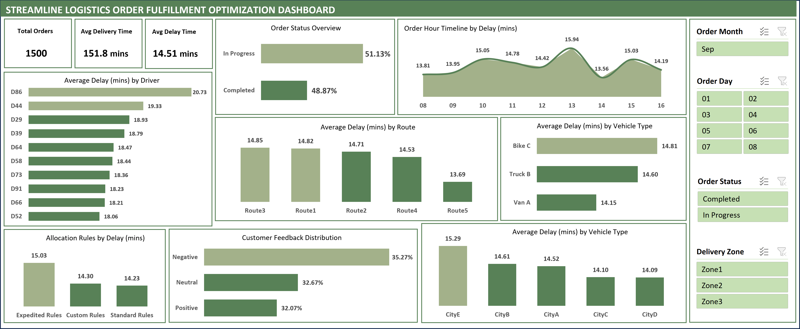

# Optimizing Order Fulfillment with Excel Dashboards and Automating KPIs via Office Scripts

## Table of Contents

- [Business Problem](#business-problem)
- [Rationale for the Project](#rationale-for-the-project)
- [Aim of the Project](#aim-of-the-project)
- [Data Description](#data-description)
- [Tech Stack](#tech-stack)
- [Project Scope](#project-scope)
- [Insights and Recommendations](#insights-and-recommendations)

## Business Introduction
Streamline Logistics Solutions is a distinguished veteran of the supply chain and logistics industry with over two decades of proven expertise. They have built their reputation through an unwavering commitment to exceptional service, delivering a diverse range of products nationwide with remarkable speed and reliability.

As a top player in the industry, they have established themselves as a critical pillar of dependability, offering businesses and consumers a transportation partner they can trust implicitly. Their operational model ensures that every shipment is handled with precision and care, transforming logistical challenges into seamless experiences.

Yet, despite their impressive track record of success and continued growth, they now confront an operational challenge that demands innovative strategic solutions. This challenge represents an opportunity to further elevate their already stellar service excellence, pushing the boundaries of what is possible in logistics management.

## Business Problem
Streamline Logistics Solutions encounter several pressing challenges within their order fulfillment process, namely:
- Mounting Order Backlogs: Their current routing and resource allocation processes have led to a growing backlog of orders. This situation is compromising delivery timelines and diminishing customer satisfaction.
- Visibility Gap: Customers frequently lack access to real-time updates on their order progress, resulting in communication gaps and increasing dissatisfaction.
- Customer Frustration: The frequency of customer complaints regarding delayed deliveries and inadequate communication channels is rising, tarnishing the company’s reputation for reliability.
- Escalating Costs: Operational expenses are increasing due to overtime payments and the need for expedited shipping to address order backlogs.

## Rationale for the Project
Order Fulfillment is the process of receiving, processing, and delivering customer orders. It involves activities such as inventory management, order processing, picking and packing products, and shipping them to customers. In the context of order fulfillment, backlogs refer to a situation where there is a delay or accumulation of unprocessed orders. 

Backlogs can result from various factors, including high demand, operational inefficiencies, or unforeseen disruptions, and they can negatively impact customer satisfaction, as customers may experience delays in receiving their orders. Eliminating backlogs is crucial to ensuring timely and reliable order fulfillment.

Order fulfillment is the backbone of the company's  operations in the Logistics and Supply Chain industry, where efficiency is not merely a goal but a necessity. Hence, some of the reasons this project is vital for Streamline Logistics Solutions are:

- Customer Satisfaction: Enhancing their order fulfillment processes directly translates into heightened customer satisfaction, thereby nurturing loyalty and long-term relationships.
- Operational Efficiency: Improved efficiency leads to cost savings and heightened profitability, bolstering their competitive position within the industry.
- Data-Driven Insights: Harnessing data-driven insights empowers the business to optimize resource allocation and routing, ensuring timely deliveries and improved resource management.
- Reputation Management: Addressing these operational challenges is paramount to preserving Streamline Logistics Solutions' sterling reputation for delivering excellence consistently.

## Aim of the Project
This project's primary objectives are to develop an Excel interactive dashboard that provides unparalleled visibility into our order fulfillment processes. Also, in order to adequately track and monitor some important metrics important to the business, an automated ad-hoc report will be generated to continously monitor these metrics. Through this, we aim to:
- Efficiently allocate delivery resources based on order volume and location.
- Monitor order progress and proactively identify potential delays.
- Enhance customer communication with timely delivery status updates.
- Reduce order backlogs and operational costs.
- Elevate overall customer satisfaction and safeguard our reputation as an industry leader.

## Data Description
The data for this project comprises of the following;

- Order ID: A unique identifier for each customer order.
- Delivery Address: The address to which the order is to be delivered.
- Order Timestamp: The date and time when the order was placed (e.g., "2023-09-01 08:00").
- Order Status: The current status of the order (e.g., "In Progress" or "Completed").
- Driver ID: A unique identifier for each driver assigned to deliver orders.
- Vehicle Info: Information about the delivery vehicle used for the order.
- Current Location: The current location of the delivery driver during order delivery.
- Delivery Time: The total time taken for delivery, measured in minutes (e.g., "120 min").
- Delays: Any delays that occurred during the delivery, measured in minutes (e.g., "15 min").
- Customer Feedback: Feedback from the customerregarding the delivery experience (e.g., "Positive" or "Negative").
- Route: The specific route taken by the delivery driver for the order.
- Delivery Zone: The geographic zone or area where the delivery is made.
- Allocation Rules: Rules used to allocate resources for the delivery (e.g., "Standard Rules" or "Expedited Rules").
- Timestamp for Tracking: The date and time of tracking data points (e.g., "2023-09-01 08:15").

## Tech Stack
Tool – Microsoft Excel
- Utilized for creating the interactive dashboard, data visualization, and automated ad-hoc report generation using office scripts.
- Data Processing Tools: Leveraging Excel's data manipulation and analysis functions.
- Visualization Tools: Employing Excel's charts, graphs, and pivot tables for order and delivery data visualization.

## Project Scope
1. Data Preprocessing and Exploratory Analysis
   - Rigorous data formatting and preparation
   - Identify patterns, correlations, and potential data anomalies
   - Address any data quality issues

2. Data Augmentation
   - Enrich the original dataset with additional relevant information
   - Prepare data to comprehensively answer business questions

3. Data Visualization and Dashboard Design
   - Create visual representations of key insights
   - Develop an interactive Excel dashboard with intuitive data visualization components
   - Effectively communicate findings through clear and compelling visuals

4. Automated Reporting
   - Create Office Scripts to automate ad-hoc report generation
   - Develop scripts to calculate and track important business metrics
   - Ensure consistent and efficient metric tracking

5. Interpretation and Recommendations
   - Extract meaningful insights from the analyzed data
   - Develop comprehensive documentation
   - Provide actionable recommendations based on the analysis

## Insights and Recommendations

You can view and interact with the dashboard [here](https://hullacuk-my.sharepoint.com/personal/m_o_lawal-2021_hull_ac_uk/_layouts/15/Doc.aspx?sourcedoc={300767bd-d123-4785-a64f-f61272b175a4}&action=embedview&AllowTyping=True&ActiveCell='Dashboard'!A1&wdHideGridlines=True&wdHideHeaders=True&wdInConfigurator=True&wdInConfigurator=True)

## Delivery Performance Analysis: Key Insights and Strategic Recommendations
Our comprehensive analysis of delivery operations reveals critical opportunities for operational enhancement and customer experience improvement.

## Key Insights

1. Order Backlog Management: We identified a substantial operational challenge: 51% of orders (767 out of 1,500) remain unprocessed. This significant backlog poses immediate risks to customer satisfaction and operational efficiency.

2. Performance Metrics

   - Average Delivery Delay: 15.51 minutes
   - Drivers with Highest Delay Variance: D86, D44, and D29
   - Most Challenging Routes: Route 3, Route 1, and Route 2

3. Nuanced Performance Observations: Interestingly, the data reveals counterintuitive patterns:

   - Positive feedback orders show slightly higher delay times
   - Bike C consistently experiences marginally longer delivery times compared to Van A
   - Expedited allocation rules unexpectedly demonstrate less efficiency than standard methods

## Strategic Recommendations
1. Operational Optimization

   - Implement immediate resource reallocation to address existing order backlog
   - Conduct targeted driver performance training
   - Develop route optimization strategies focusing on high-delay routes

2. Allocation and Resource Strategy

   - Critically review current allocation rules, particularly Expedited Rules
   - Reassess vehicle allocation, potentially reducing Bike C deployments
   - Develop a more dynamic resource deployment model

3. Customer Experience Enhancement

   - Establish proactive communication protocols for managing customer expectations
   - Create transparent tracking mechanisms for orders with potential delays
   - Develop personalized communication strategies based on order type and customer segment

## Next Steps
Our recommendation is to initiate a phased implementation approach:
- Immediate (0-30 days): Backlog reduction and communication improvements
- Short-term (30-90 days): Driver training and route optimization
- Medium-term (90-180 days): Comprehensive allocation rule and vehicle fleet review

By systematically addressing these insights, we anticipate significant improvements in operational efficiency, customer satisfaction, and overall delivery performance.
